# BIGDATASTACK — Big Data Stack local con Docker Compose

Repositorio **demo/portfolio** para levantar un entorno Big Data **end-to-end** en un único `docker compose`, con foco en prácticas reales: **ingesta → procesamiento → orquestación → almacenamiento → BI/analytics → automatización**.

Incluye:
- **MariaDB** (fuente de datos + DBs de Airflow/Superset)
- **MinIO** (S3-compatible / datalake)
- **Apache Kafka + Zookeeper** (streaming / event bus)
- **Apache Spark** (master + 2 workers + history server)
- **Apache Airflow** (CeleryExecutor + Redis) + **Flower**
- **Apache Superset** (BI / dashboards)
- **JupyterLab** (notebooks conectados a Spark)
- **Adminer** (UI para MariaDB)
- **n8n** (automatización / webhooks + opción OAuth vía ngrok)

> Importante: **no subas `.env` al repo**. Usá **`.env.template`** como plantilla.

## Tabla de contenidos

- [Arquitectura](#arquitectura)
- [Requisitos](#requisitos)
- [Quick start](#quick-start)
- [Comandos (controller.sh)](#comandos-controllersh)
- [URLs de servicios (modo local)](#urls-de-servicios-modo-local)
- [Flujos y ejemplos](#flujos-y-ejemplos)
- [Persistencia y volúmenes](#persistencia-y-volúmenes)
- [Modo público (ngrok + n8n)](#modo-público-ngrok--n8n)
- [Troubleshooting](#troubleshooting)
- [Seguridad / buenas prácticas](#seguridad--buenas-prácticas)

## Arquitectura

### Vista general

- Diagrama (alto nivel): [`docs/diagrama_arquitectura_bigdatastack_altonivel.svg`](docs/diagrama_arquitectura_bigdatastack_altonivel.svg)



### Servicios y componentes

- Arquitectura general - BIGDATASTACK: [`docs/diagrama_arquitectura_bigdatastack.svg`](docs/diagrama_arquitectura_bigdatastack.svg)


### Flujo típico Airflow → Spark → MariaDB/MinIO → Superset/Jupyter

- Diagrama: [`docs/diagrama_flujo_dag_airflow_spark.svg`](docs/diagrama_flujo_dag_airflow_spark.svg)


### OAuth n8n + ngrok + Gmail (referencia)

- Diagrama: [`docs/diagrama_oauth_n8n_ngrok_gmail.svg`](docs/diagrama_oauth_n8n_ngrok_gmail.svg)


## Requisitos

- Docker Engine + Docker Compose plugin
- Bash (Linux/macOS). En Windows: WSL recomendado.
- **Node.js** (el `controller.sh` lo usa para chequear health de n8n)
- (Opcional) **ngrok** si querés n8n público
- RAM:
  - mínimo: 8 GB
  - recomendado: 16 GB (Spark + Superset + Airflow juntos)

Puertos por defecto (podés cambiarlos en `.env`):
- MariaDB: `3306`
- Adminer: `8089`
- Spark: `7077`, UIs `8080–8082`, History `18080`
- Superset: `8088`
- JupyterLab: `8888`
- Airflow: `8090`
- Flower: `5555`
- MinIO: `9000` (API) / `9001` (console)
- n8n: `5678`
- Kafka/Zookeeper: `9092` / `2181`

## Quick start

### 1) Crear tu `.env` desde la plantilla

```bash
cp .env.template .env
```

### 2) Editar secrets (obligatorio)

Abrí `.env` y completá los `CHANGEME_*` (por ejemplo):
- `MARIADB_ROOT_PASSWORD`, `MARIADB_PASSWORD`
- `SUPERSET_SECRET_KEY`, `SUPERSET_ADMIN_PASSWORD`
- `JUPYTER_TOKEN`
- `AIRFLOW_ADMIN_PASS`, `AIRFLOW__CORE__FERNET_KEY`, `AIRFLOW__WEBSERVER__SECRET_KEY`
- `N8N_BASIC_AUTH_PASSWORD`, `N8N_ENCRYPTION_KEY`

> Tip: si ya tenés un `.env` funcionando, mantené esas claves estables (especialmente Airflow/N8N), para evitar invalidar sesiones/credenciales.

### 3) Permisos del controlador y arranque

```bash
chmod +x controller.sh
./controller.sh up
```

El controlador:
- carga variables desde `.env`
- crea estructura de `./volumenes/`
- genera `init-sql/00-init-all.sql` desde template
- levanta `docker compose`
- espera healthchecks
- inicializa DB de Airflow si hace falta
- crea conexión `spark_default` en Airflow

## Comandos (controller.sh)

Uso:

```bash
./controller.sh {up [--debug-build]|up-public|down|status|clean|full-clean}
```

- `./controller.sh` o `./controller.sh up`: modo **LOCAL** (sin ngrok)
- `./controller.sh up --debug-build`: rebuild con logs detallados (útil para debug)
- `./controller.sh up-public`: modo **PÚBLICO** (ngrok + URLs externas para n8n)
- `./controller.sh down`: baja contenedores
- `./controller.sh status`: estado
- `./controller.sh clean`: limpia logs Airflow y eventos Spark
- `./controller.sh full-clean`: **BORRA TODOS LOS EXISTENTES - NO IMPORTA SI SON DE ESTA INFRA O NO, CUIDADO!!!!** (contenedores/volúmenes/imágenes + `./volumenes`) — pide confirmación

## URLs de servicios (modo local)

> Estas URLs asumen puertos por defecto y el stack corriendo en tu máquina.

| Servicio | URL |
|---|---|
| Adminer | http://localhost:8089 |
| MinIO Console | http://localhost:9001 |
| MinIO API | http://localhost:9000 |
| Spark Master UI | http://localhost:8080 |
| Spark Worker 1 UI | http://localhost:8081 |
| Spark Worker 2 UI | http://localhost:8082 |
| Spark History | http://localhost:18080 |
| Superset | http://localhost:8088 |
| JupyterLab | http://localhost:8888 |
| Airflow | http://localhost:8090 |
| Flower | http://localhost:5555 |
| n8n | http://localhost:5678 |

Kafka/Zookeeper (no tienen UI web por defecto):
- desde host: `localhost:9092`, `localhost:2181`
- desde contenedores: `kafka-broker:9092`, `zookeeper:2181`

## Flujos y ejemplos

### A) MariaDB (validar que responde)

```bash
docker exec -it mariadb mariadb -u"${MARIADB_USER}" -p"${MARIADB_PASSWORD}" -e "SELECT 1;"
```

### B) Kafka (crear topic + producir/consumir)

Crear topic:

```bash
docker exec -it kafka-broker bash -lc "kafka-topics --bootstrap-server kafka-broker:9092 --create --topic test_topic --partitions 1 --replication-factor 1"
```

Producir:

```bash
docker exec -it kafka-broker bash -lc "kafka-console-producer --bootstrap-server kafka-broker:9092 --topic test_topic"
```

Consumir:

```bash
docker exec -it kafka-broker bash -lc "kafka-console-consumer --bootstrap-server kafka-broker:9092 --topic test_topic --from-beginning"
```

### C) Spark desde JupyterLab

- Abrí JupyterLab en http://localhost:8888
- Usá el token definido en `.env`
- Ejecutá el notebook de ejemplo (si existe):
  - `notebooks/sensores_demo.ipynb`

### D) Airflow (DAGs de ejemplo)

El `controller.sh` copia (si están presentes) plantillas de DAGs y scripts a la carpeta compartida:
- `./volumenes/shared/dags_airflow/`
- `./volumenes/shared/scripts_airflow/`

DAGs copiados (según `controller.sh`):
- `dag_test_mariadb.py`
- `dag_mariadb_to_kafka.py`
- `dag_kafka_to_minio.py`
- `dag_kafka_to_csv.py`
- `dag_spark_get_data_minio.py`

> Además, el controlador crea/asegura la conexión `spark_default` apuntando a `spark://spark-master:7077`.

## Persistencia y volúmenes

Persistencia local bajo `./volumenes/`:
- `volumenes/mariadb` → datos MariaDB
- `volumenes/minio/data` → datos MinIO
- `volumenes/superset` → home/config de Superset
- `volumenes/jupyterlab` → notebooks y trabajo
- `volumenes/airflow-logs`, `volumenes/airflow-plugins`
- `volumenes/redis-data`
- `volumenes/n8n-data`
- `volumenes/shared/` → **carpeta compartida** (DAGs, scripts, eventos Spark, outputs)

> El stack usa volúmenes bind para facilitar inspección, versionado local y debugging.

## Modo público (ngrok + n8n)

El modo público está pensado para:
- exponer n8n mediante **HTTPS público**
- configurar OAuth (por ejemplo, Gmail) usando redirect URL pública

Arranque:

```bash
./controller.sh up-public
```

El controlador:
- inicia ngrok (si está instalado)
- exporta para la sesión variables como `N8N_WEBHOOK_URL`, `N8N_HOST`, `N8N_PROTOCOL`, `N8N_PORT`
- imprime en consola los valores que debés pegar en Google Cloud Console:
  - **Authorized redirect URIs**: `https://<tu-dominio-ngrok>/rest/oauth2-credential/callback`
  - **Authorized JavaScript origins**: `https://<tu-dominio-ngrok>`

## Troubleshooting

- **No levanta por falta de `.env`**: crealo desde `.env.template`.
- **Puertos ocupados**: cambiá puertos en `.env` (por ejemplo `AIRFLOW_PORT`, `SUPERSET_PORT`, `JUPYTER_PORT`, `MINIO_PORT`).
- **n8n no responde**: el controlador lo chequea con Node. Confirmá que `node` esté instalado.
- **Airflow tarda**: esperá el init de DB; revisá logs:
  - `docker logs -f airflow-webserver`
  - `docker logs -f airflow-scheduler`
  - `docker logs -f airflow-worker`
- **Spark UI ok pero jobs fallan**: revisá driver/executor memory en `.env` y los logs de Spark.
- **Kafka no listo**: el controlador intenta listar topics; revisá `docker logs -f kafka-broker`.

## Seguridad / buenas prácticas

- **No commitear** `.env`.
- Rotar secrets si se filtraron (Superset/Airflow/n8n).
- En `up-public`: usá Basic Auth fuerte en n8n y preferí dominios/URLs estables.
- Si publicás el repo, evitá subir:
  - `client_secret*.json`, `credentials*.json`, tokens OAuth
  - dumps con datos reales

## Licencia

MIT.
